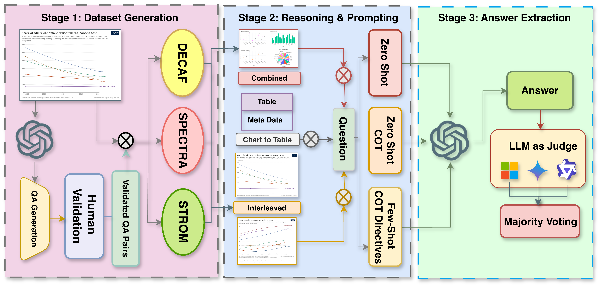

# INTERCHART: Benchmarking Visual Reasoning Across Decomposed and Distributed Chart Information

### A Diagnostic Benchmark for Multi-Chart Visual Reasoning



---

## Overview

**INTERCHART** is a diagnostic benchmark designed to evaluate how well Vision-Language Models (VLMs) reason across *multiple related charts*—a task central to real-world analytical domains such as scientific reporting, financial analysis, and public health dashboards.  
The benchmark decomposes and structures reasoning difficulty into three subsets:

- **DECAF** – Decomposed Elementary Charts with Answerable Facts (factual and comparative reasoning)  
- **SPECTRA** – Synthetic Plots for Event-based Correlated Trend Reasoning and Analysis (trend and correlation reasoning)  
- **STORM** – Sequential Temporal Reasoning Over Real-world Multi-domain Charts (semantic abstraction and temporal synthesis)

Each subset probes a distinct reasoning capability under increasing visual and semantic complexity.

---

## Resources

- **Paper:** [INTERCHART: Benchmarking Visual Reasoning Across Decomposed and Distributed Chart Information](https://arxiv.org/abs/2508.07630v1)
- **Dataset & Scripts:** [Hugging Face – coral-lab-asu/InterChart](https://huggingface.co/datasets/interchart/Interchart)
- **Project Website:** [https://coral-lab-asu.github.io/interchart/](https://coral-lab-asu.github.io/interchart/)

---

## Evaluation Framework

INTERCHART employs multiple LLM-based semantic judges (Gemini, Phi, Qwen) to assess answer correctness through majority voting.
This allows flexible evaluation of paraphrases, numeric ranges, and unit variations beyond simple string matching.

---

## Citation

If you use **INTERCHART** or its code, please cite:

```
@inproceedings{kaniyar2025interchart,
  title={INTERCHART: Benchmarking Visual Reasoning Across Decomposed and Distributed Chart Information},
  author={Kaniyar Narayana Iyengar, Anirudh Iyengar and Choudhury, Manan Roy and Siingh, Shikhhar and Sugeeth, Raghavendra and Gupta, Vivek},
  booktitle={Findings of the Association for Computational Linguistics: EMNLP},
  year={2025}
}
```

